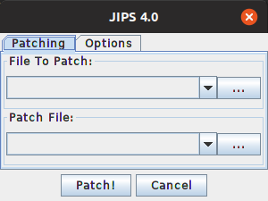
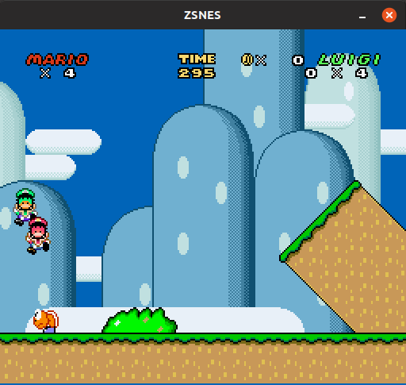

# Jips

Simple java app to apply ips patch on rom files.
Checkout on [releases](https://github.com/humbertodias/java-patch-ips/releases).

# Req

* Java 8+
* Maven 3+

# Run

    mvn package
    
    java -jar target/jips.jar
    
    

## Usage

### Patch

This patch changes a snes rom super mario world, to be able to play with Luigi as second player.

[smw.ips](doc/smw.ips)

### Rom (Original)

[Super Mario World (U) [!].smc](https://romsmania.cc/roms/super-nintendo/super-mario-world-254711)
    
After applied, on Zsnes

    

You can play with Mario and Luigi SIMULTANEOUS!

[Youtube gamaplay](https://www.youtube.com/watch?v=RNHEcK1_Zl0)

    
# Ref

* [Zsnes](http://zsnes.com)

* [JIPS](https://zerosoft.zophar.net/jips.php)

* [MultiPatch](http://projects.sappharad.com/tools/multipatch.html)

* [Flips](https://github.com/Alcaro/Flips)

* [Lazy Ips](https://github.com/btimofeev/lazy_ips)

* [RomPatcher.js](https://www.marcrobledo.com/RomPatcher.js)
